# PRD — Body Signature Backend & E-Commerce Platform (Phase 2)

> **الحالة:** النطاق اتحدد بناءً على قرارات صاحب المشروع (2026-08-23). لسه مفيش تاريخ تسليم ملزم، لكن النطاق دلوقتي واضح ومفصّل بما يكفي للبناء.
>
> **خارج النطاق صراحةً:** بوابات الدفع الأونلاين (Payment Gateway) وتطبيق الموبايل. كل حاجة تانية مذكورة هنا **داخل النطاق**.

---

## 0. السياق الحالي

الموقع الحالي (`zefaaf-body-signature`) هو Next.js 16 (App Router) + TypeScript، **صفحات ثابتة بالكامل**، بدون أي باك ايند، قاعدة بيانات، أو حسابات. 3 لغات (AR/EN/NL) عبر `next-intl`. فورم التواصل موجود بصريًا فقط.

المرحلة دي بتحوّل الموقع من "موقع تعريفي" إلى **منصة كاملة**: حسابات عملاء، حجز مواعيد، متجر إلكتروني كامل (تصنيفات/منتجات/سلة/مفضلة/طلبات)، ولوحة تحكم بدورين (Admin + Assistant) تتحكم في كل محتوى الموقع.

---

## 1. الأهداف

1. عميل يقدر يعمل حساب (إيميل/باسورد أو جوجل)، يتصفح المنتجات، يضيف للسلة/المفضلة، ويعمل طلب (Order) — ويتابع حالته لحد ما يوصله.
2. عميل يقدر يحجز موعد لخدمة معيّنة، ويتم تأكيد الحجز يدويًا من الأدمن.
3. فريق Body Signature (Admin + Assistant) يديروا **كل** محتوى الموقع (خدمات، منتجات، تصنيفات، صفحات، صور، رسائل تواصل، حجوزات، طلبات) من لوحة تحكم واحدة، بدون الحاجة لمطوّر.
4. كل تواصل بالإيميل (تفعيل حساب، استرجاع باسورد، تأكيد طلب/حجز، تحديث حالة) يطلع من **نفس القالب البصري الموحّد** للبراند.

---

## 2. النطاق

### 2.1 داخل النطاق
| المحور | التفاصيل |
|---|---|
| **الحسابات (Auth)** | تسجيل/دخول بالإيميل+باسورد، تسجيل دخول بجوجل (OAuth)، تفعيل الإيميل بـ OTP، استرجاع الباسورد بـ OTP، بروفايل العميل |
| **لوحة التحكم** | دورين: **Admin** (صلاحية كاملة) و **Assistant** (صلاحيات تشغيلية، بدون إدارة الفريق/الإعدادات) |
| **CMS** | تحكم كامل في كل نصوص/صور الموقع (Home, About, Services, Pages) بالـ 3 لغات |
| **فورم التواصل** | استقبال + تخزين + إشعار إيميل بقالب موحّد |
| **الحجز (Booking)** | حجز موعد لخدمة، **يتطلب موافقة يدوية من الأدمن** (مش تأكيد تلقائي) |
| **الكتالوج (Catalog)** | تصنيفات (Categories، بأقسام فرعية)، منتجات (Products) بالتفاصيل والصور والمتغيرات (لون/مقاس لو موجود) |
| **السلة والمفضلة** | Add to Cart، Add to Wishlist، لكل مستخدم مسجّل |
| **الطلبات (Orders)** | العميل يعمل Order من السلة، ويتابع دورة حياته لحد التسليم، مع تحديثات من الأدمن في كل خطوة |
| **الإيميلات** | نظام قوالب موحّد لكل الإشعارات (OTP، ريسيت باسورد، تأكيد طلب، تحديث حالة، تأكيد/رفض حجز، رد فورم التواصل) |

### 2.2 خارج النطاق (مؤكد من صاحب المشروع)
- **الدفع الأونلاين (Payment Gateway):** الطلبات هتتعمل من غير دفع إلكتروني مباشر. الافتراض المبدئي: **الدفع كاش عند الاستلام (COD) أو تحويل يدوي يتأكد من الأدمن** — ده افتراض عملي عشان نقدر نكمّل التصميم، ولازم تأكيد صريح منكم (شوف قسم 9، سؤال مفتوح رقم 1).
- **تطبيق الموبايل.**
- **CRM متقدم / تقارير تحليلية معقدة** — ممكن تتضاف كطبقة فوق الداتا الموجودة لاحقًا، مش جزء من الـ MVP بتاع الباك ايند.

---

## 3. المستخدمون (Personas)

| الشخصية | الوصف |
|---|---|
| **زائر (Guest)** | يتصفح الموقع/المنتجات بدون تسجيل دخول. لازم يسجّل عشان يحجز أو يعمل Order (مفيش guest checkout). |
| **عميل مسجّل (Customer)** | عنده بروفايل، سلة، مفضلة، تاريخ طلبات وحجوزات. |
| **Assistant** | عضو فريق، بيدخل لوحة التحكم لإدارة المنتجات/الطلبات/الحجوزات/المحتوى/رسائل التواصل اليومية. |
| **Admin** | نفس صلاحيات الـ Assistant + إدارة حسابات الفريق (إضافة/حذف Assistant) + إعدادات النظام العامة. |

---

## 4. الميزات بالتفصيل

### 4.1 المصادقة وحسابات العملاء (Auth)
- **تسجيل حساب جديد:**
  - بالإيميل + باسورد → إرسال **OTP** على الإيميل لتفعيل الحساب (الحساب معلّق لحد التفعيل).
  - أو **تسجيل دخول مباشر بجوجل (Google OAuth)** — لو الإيميل جديد يتعمله حساب تلقائيًا (متفعّل من الأول لأن جوجل أكدت الإيميل).
- **تسجيل الدخول:** إيميل+باسورد أو جوجل.
- **استرجاع الباسورد:** المستخدم يدخل إيميله → يستلم **OTP** → يدخله + الباسورد الجديد (مش لينك، كود مباشر زي التفعيل — نفس الآلية للاثنين لتبسيط الكود).
- **البروفايل:** الاسم، الإيميل، رقم الموبايل، العنوان (للطلبات)، وتاريخ الطلبات/الحجوزات.
- **حماية:** OTP له مدة صلاحية قصيرة (مثلاً 10 دقايق) وعدد محاولات محدود؛ rate limiting على endpoints الدخول/التسجيل.

### 4.2 لوحة التحكم — الأدوار والصلاحيات
دورين بس داخل الداشبورد:

| الوحدة | Admin | Assistant |
|---|:---:|:---:|
| المنتجات والتصنيفات | ✅ | ✅ |
| الطلبات (متابعة وتحديث الحالة) | ✅ | ✅ |
| الحجوزات (موافقة/رفض) | ✅ | ✅ |
| محتوى الموقع (CMS) | ✅ | ✅ |
| رسائل فورم التواصل | ✅ | ✅ |
| إدارة حسابات الفريق (إضافة/حذف Assistant) | ✅ | ❌ |
| الإعدادات العامة (قوالب الإيميل، بيانات البراند) | ✅ | ❌ |

> ملاحظة: الجدول ده افتراض عملي لتوزيع صلاحيات معقول بين الاتنين — قابل للتعديل بسهولة لأنه مجرد enum/permission list في التصميم، مش قيد معماري.

### 4.3 CMS — إدارة كل محتوى الموقع
- كل نص/صورة في الموقع (Home, About, Services, صفحات إضافية) يتحرر من الداشبورد، **بالـ 3 لغات إجباريًا** (مفيش نشر لغة ناقصة).
- إدارة الوسائط (Media Library): رفع صور، استبدال الصور الحالية (placeholder SVGs) بصور حقيقية.
- إدارة الخدمات (Services): نفس الفئات الخمسة الحالية + إمكانية إضافة/تعديل خدمات جديدة.

### 4.4 فورم التواصل
- استقبال الرسالة → تخزينها → إشعار فوري للفريق بالإيميل (بالقالب الموحّد) → رسالة تأكيد تلقائية للزائر.
- حماية من السبام: honeypot + rate limiting.
- الأدمن/الـ Assistant يشوفوا الرسائل في لوحة التحكم ويعلّموها "متم الرد".

### 4.5 الحجز (Booking)
- العميل (لازم يكون مسجّل دخول) يختار خدمة + وقت متاح من تقويم بسيط ويبعت طلب حجز.
- الحجز بيدخل بحالة **"قيد المراجعة" (Pending)** — الأدمن/الـ Assistant يوافق أو يرفض أو يقترح ميعاد بديل.
- عند تغيير الحالة، العميل يستلم إيميل تلقائي (بالقالب الموحّد) بالنتيجة.

**حالات الحجز:** `Pending → Confirmed | Rejected | Rescheduled → (Confirmed) | Cancelled`

### 4.6 الكتالوج — تصنيفات ومنتجات
- **Category:** اسم، وصف، صورة، وممكن تصنيف فرعي (Category تحت Category — زي "تجميل > نساء" أو "تجميل > رجال").
- **Product:** اسم، وصف، السعر، صور متعددة، الكمية المتاحة (stock)، حالة النشاط (active/inactive)، ومتغيرات اختيارية (Variant) زي اللون/المقاس لو المنتج محتاج كده.
- كل بيانات النصوص (اسم/وصف المنتج والتصنيف) بالـ 3 لغات.
- الأدمن/الـ Assistant يضيفوا/يعدّلوا/يشيلوا منتجات وتصنيفات من الداشبورد بالكامل.

### 4.7 السلة والمفضلة (Cart & Wishlist)
- كل عميل مسجّل عنده سلة ومفضلة خاصة بيه (مربوطة بالحساب، مش بجلسة متصفح مؤقتة — لأن مفيش guest checkout).
- **Add to Cart:** إضافة/تعديل كمية/حذف منتج من السلة.
- **Add to Wishlist:** إضافة/حذف منتج من قائمة الأمنيات، مع إمكانية نقله من المفضلة للسلة مباشرة.

### 4.8 الطلبات (Orders) ودورة حياتها
- العميل يحوّل محتوى السلة لطلب (Order)، بيسجّل عنوان الشحن ورقم التواصل.
- **دورة حياة الطلب (Order Lifecycle):**

```
Pending (تم استلام الطلب)
   → Confirmed (الأدمن راجع وأكّد الطلب)
      → Processing (جاري التجهيز)
         → Shipped (تم الشحن/في الطريق)
            → Delivered (تم التسليم للعميل)

فروع بديلة: Pending/Confirmed → Cancelled (إلغاء من العميل أو الأدمن)
```

- في كل تغيير حالة، العميل يستلم إيميل تلقائي بالتحديث (بالقالب الموحّد)، والتغيير يتسجّل في سجل (Order Status History) لمعرفة مين غيّر الحالة وإمتى.
- العميل يقدر يشوف كل طلباته السابقة وحالتها الحالية في بروفايله.

### 4.9 نظام الإيميلات
- **قالب HTML واحد موحّد** (شعار البراند + الألوان الذهبية + تخطيط ثابت) — كل إيميل في النظام (OTP، ريسيت باسورد، تأكيد طلب، تحديث حالة طلب، حجز، رد فورم تواصل) هو نفس القالب مع محتوى مختلف جوّاه.
- كل قالب متوفر بالـ 3 لغات (يتحدد حسب لغة المستخدم وقت التسجيل/التصفح).

---

## 5. نموذج البيانات — ERD

```mermaid
erDiagram
    USER ||--o| CART : has
    USER ||--o| WISHLIST : has
    USER ||--o{ ORDER : places
    USER ||--o{ BOOKING : requests
    USER ||--o{ OTP_CODE : receives
    USER ||--o{ OAUTH_ACCOUNT : links
    USER ||--o{ ORDER_STATUS_HISTORY : "updates (staff)"

    CATEGORY ||--o{ CATEGORY : "parent of"
    CATEGORY ||--o{ CATEGORY_TRANSLATION : has
    CATEGORY ||--o{ PRODUCT : contains

    PRODUCT ||--o{ PRODUCT_TRANSLATION : has
    PRODUCT ||--o{ PRODUCT_IMAGE : has
    PRODUCT ||--o{ PRODUCT_VARIANT : has
    PRODUCT ||--o{ CART_ITEM : "referenced by"
    PRODUCT ||--o{ WISHLIST_ITEM : "referenced by"
    PRODUCT ||--o{ ORDER_ITEM : "referenced by"

    CART ||--o{ CART_ITEM : contains
    WISHLIST ||--o{ WISHLIST_ITEM : contains

    ORDER ||--o{ ORDER_ITEM : contains
    ORDER ||--o{ ORDER_STATUS_HISTORY : tracks

    SERVICE ||--o{ SERVICE_TRANSLATION : has
    SERVICE ||--o{ BOOKING : "booked as"
    SERVICE ||--o{ AVAILABILITY_SLOT : has

    PAGE ||--o{ PAGE_TRANSLATION : has

    EMAIL_TEMPLATE ||--o{ EMAIL_TEMPLATE_TRANSLATION : has

    USER {
        int id PK
        string email UK
        string password_hash "nullable if OAuth-only"
        string name
        string phone
        string avatar_url
        string role "customer | assistant | admin"
        bool email_verified
        datetime created_at
    }

    OAUTH_ACCOUNT {
        int id PK
        int user_id FK
        string provider "google"
        string provider_account_id
    }

    OTP_CODE {
        int id PK
        int user_id FK
        string code
        string purpose "verify_email | reset_password"
        datetime expires_at
        datetime used_at
    }

    CATEGORY {
        int id PK
        int parent_id FK "nullable, self-reference"
        string slug UK
        string image_url
        bool is_active
    }

    CATEGORY_TRANSLATION {
        int id PK
        int category_id FK
        string locale "ar | en | nl"
        string name
        string description
    }

    PRODUCT {
        int id PK
        int category_id FK
        string sku UK
        decimal price
        int stock_quantity
        bool is_active
        datetime created_at
    }

    PRODUCT_TRANSLATION {
        int id PK
        int product_id FK
        string locale
        string name
        string description
    }

    PRODUCT_IMAGE {
        int id PK
        int product_id FK
        string url
        int sort_order
    }

    PRODUCT_VARIANT {
        int id PK
        int product_id FK
        string attribute "e.g. size, color"
        string value
        decimal price_modifier
        int stock_quantity
    }

    CART {
        int id PK
        int user_id FK
        datetime updated_at
    }

    CART_ITEM {
        int id PK
        int cart_id FK
        int product_id FK
        int variant_id FK "nullable"
        int quantity
    }

    WISHLIST {
        int id PK
        int user_id FK
    }

    WISHLIST_ITEM {
        int id PK
        int wishlist_id FK
        int product_id FK
    }

    ORDER {
        int id PK
        int user_id FK
        string order_number UK
        string status "pending|confirmed|processing|shipped|delivered|cancelled"
        decimal total_amount
        string shipping_address
        string phone
        string payment_method "cod | manual_transfer"
        datetime created_at
    }

    ORDER_ITEM {
        int id PK
        int order_id FK
        int product_id FK
        int variant_id FK "nullable"
        int quantity
        decimal unit_price
        decimal subtotal
    }

    ORDER_STATUS_HISTORY {
        int id PK
        int order_id FK
        int changed_by_user_id FK "staff member"
        string status
        string note
        datetime created_at
    }

    SERVICE {
        int id PK
        string slug UK
        bool is_bookable
        int duration_minutes
    }

    SERVICE_TRANSLATION {
        int id PK
        int service_id FK
        string locale
        string title
        string description
    }

    AVAILABILITY_SLOT {
        int id PK
        int service_id FK
        date date
        time start_time
        time end_time
        bool is_available
    }

    BOOKING {
        int id PK
        int user_id FK
        int service_id FK
        int slot_id FK "nullable"
        string status "pending|confirmed|rejected|rescheduled|cancelled"
        string admin_note
        datetime requested_at
        datetime created_at
    }

    PAGE {
        int id PK
        string slug UK
    }

    PAGE_TRANSLATION {
        int id PK
        int page_id FK
        string locale
        json content
        string seo_title
        string seo_description
    }

    CONTACT_SUBMISSION {
        int id PK
        string name
        string email
        string phone
        string message
        string locale
        string status "new|read|replied"
        datetime created_at
    }

    EMAIL_TEMPLATE {
        int id PK
        string key UK "otp_verify | otp_reset | order_status | booking_status | contact_ack"
    }

    EMAIL_TEMPLATE_TRANSLATION {
        int id PK
        int template_id FK
        string locale
        string subject
        string body_html
    }
```



> **ملاحظة عن `USER.role`:** استخدام جدول Users واحد بحقل `role` (customer/assistant/admin) بيبسّط الـ auth logic (كل الأنواع بتعدّي بنفس نظام تسجيل الدخول). الفرق العملي: الـ customer بس هو اللي بيستخدم OTP للتفعيل/الجوجل لوجن، بينما حسابات الـ admin/assistant بتتعمل يدويًا من الأدمن نفسه (مفيش self-signup لأدوار الداشبورد).

---

## 6. متطلبات غير وظيفية (NFRs)

- **GDPR:** البراند شغال في هولندا → أي بيانات شخصية (بروفايل، طلبات، حجوزات) لازم consent واضح، وسياسة احتفاظ/حذف بيانات عند الطلب.
- **تعدد اللغات إجباري:** أي محتوى (منتج، تصنيف، صفحة، قالب إيميل) لازم يتوفر بالـ 3 لغات قبل النشر — مفيش استثناء.
- **الأمان:** تشفير الباسورد (bcrypt/argon2)، rate limiting على auth/OTP/contact/booking endpoints، حماية كل routes الداشبورد بالدور الصحيح (RBAC بسيط: admin/assistant).
- **الأداء:** صفحات المحتوى التسويقي تفضل static/ISR قد الإمكان؛ الأجزاء التفاعلية (حساب، سلة، طلبات، داشبورد) عبر API/DB مباشرة.
- **قابلية الصيانة:** فريق واحد صغير (Admin + Assistant بس) → الأولوية لبساطة الإدارة على مرونة الإعدادات المعقدة.

---

## 7. الـ Tech Stack المقترح

| الطبقة | الاقتراح |
|---|---|
| API layer | Next.js Route Handlers / Server Actions (نفس المشروع) |
| قاعدة البيانات | PostgreSQL (Neon / Supabase) |
| ORM | Prisma أو Drizzle |
| Auth | Auth.js (NextAuth) — بيدعم Google OAuth + Credentials provider جاهز، ومناسب لتخصيص OTP flow |
| تخزين الصور/الوسائط | Supabase Storage / Vercel Blob / Cloudinary |
| الإيميلات | Resend أو SendGrid — مع React Email أو MJML لبناء القالب الموحّد |
| الاستضافة | Vercel |

---

## 8. أدوار وصلاحيات — ملخص

انظر جدول قسم 4.2. القاعدة العامة: **Admin = Assistant + إدارة الفريق + الإعدادات العامة**. مفيش أدوار تانية مطلوبة حاليًا (لا "Editor"، لا "Viewer" منفصلين).

---

## 9. أسئلة/افتراضات مفتوحة لسه محتاجة تأكيد

1. **طريقة الدفع في الطلبات:** بما إن بوابة الدفع الأونلاين خارج النطاق، افترضنا **الدفع كاش عند التسليم أو تحويل بنكي يدوي يتأكد الأدمن منه يدويًا** — هل ده صح، ولا فيه طريقة تالتة مقصودة؟
2. **الشحن:** هل فيه مناطق/تكلفة شحن مختلفة لازم تتحسب في الطلب، ولا التوصيل بيترتب يدوي بعد التأكيد بدون حساب تكلفة آلي؟
3. **المخزون (Stock):** لما المنتج يخلص، هل يظهر "غير متوفر" أوتوماتيك، ولا الأدمن هو اللي بيوقفه يدويًا؟
4. **الإرجاع/الاستبدال:** مطلوب في المرحلة دي (Returned status) ولا مؤجل لمرحلة تانية؟
5. **حجم الكتالوج المبدئي:** كام تصنيف/منتج متوقع في الإطلاق الأول؟ (بيأثر على تصميم صفحات التصفح والفلترة).

---

## 10. خارطة طريق مقترحة (Phased Rollout)

الترتيب معتمد على التبعية التقنية (الحسابات أساس لكل حاجة تانية) مش بس الأولوية:

1. **Phase 2.1 — Auth Foundation:** تسجيل/دخول (إيميل+باسورد+جوجل)، OTP تفعيل/ريسيت، بروفايل أساسي. (كل الميزات التانية محتاجاه.)
2. **Phase 2.2 — Contact Form Backend:** أسرع قيمة مستقلة، ومفيدة حتى قبل ما الكتالوج يخلص.
3. **Phase 2.3 — لوحة التحكم + CMS:** دخول Admin/Assistant، إدارة المحتوى (خدمات، صفحات، وسائط) بالـ 3 لغات.
4. **Phase 2.4 — الكتالوج:** تصنيفات ومنتجات (وإدارتها من الداشبورد).
5. **Phase 2.5 — السلة والمفضلة.**
6. **Phase 2.6 — الطلبات (Orders) ودورة حياتها الكاملة + إشعارات الإيميل.**
7. **Phase 2.7 — الحجز (Booking):** ممكن تتبنى بالتوازي مع 2.4-2.6 لأنها مش معتمدة على الكتالوج.
8. **Phase 2.8 (مستقبلي، خارج النطاق الحالي):** بوابة دفع أونلاين، تطبيق موبايل.

---

## 11. مقاييس النجاح

- عميل يقدر يعمل رحلة كاملة (تسجيل → تصفح → سلة → طلب → متابعة الحالة) بدون أي تدخل يدوي من المطوّر.
- صفر رسائل تواصل أو طلبات حجز ضايعة.
- فريق Body Signature (Admin/Assistant) يديروا كل المنتجات والمحتوى بدون Pull Request واحد.
- كل إيميل يخرج من النظام بنفس الهوية البصرية بغض النظر عن نوعه أو اللغة.
